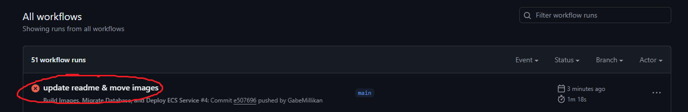
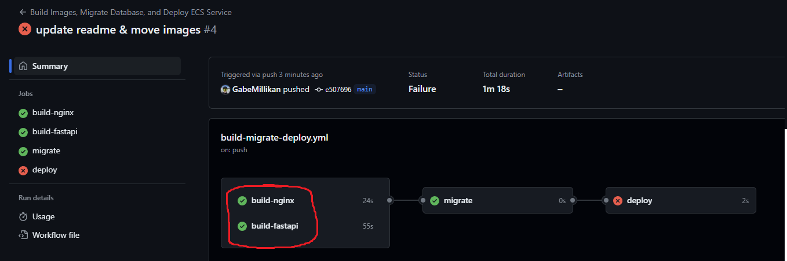
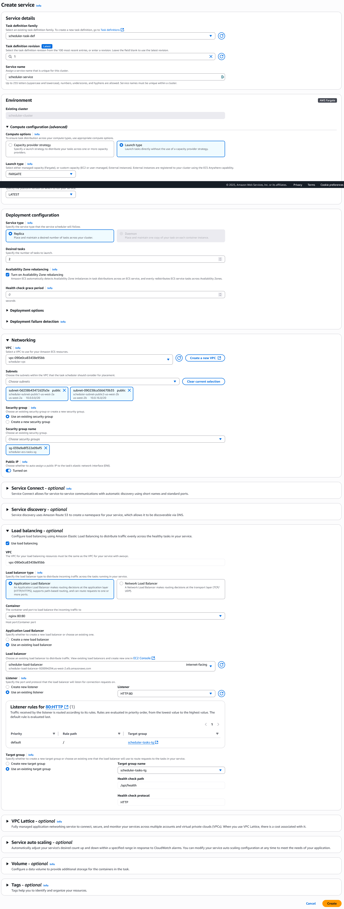

todo: explain variables + uncomment workflow steps
todo: just use names & let people change them instead of "mine is called: ..."

## Table of Contents

- [Target Audience](#target-audience) (recommended level of experience)
- [Initialize GitHub Project](#initialize-git-hub-project) (setting up and building containers)
- TODO: move or copy these to ./README.md
    - [How This Repository Works](#how-this-repository-works) (overview of the layout of code)
    - [How AWS Works](#how-this-repository-works) (overview of the AWS structure)
- [Initialize AWS Project](#initialize-aws-project) (basic AWS configuration: create VPC + ECR repos)
- [Upload Images to ECR](#upload-images-to-ecr-via-git-hub-actions) (setup GitHub -> AWS pipeline)
- [Setup Security Groups](#setup-security-groups) (configure firewalls)
- [Create an ECS Cluster](#create-an-ecs-cluster) (the home for servers)
- [Setup Load Balancing](#setup-load-balancing) (request distribution among the cluster)
- [Create an ECS Service](#create-an-ecs-service) (actually spawn server instances)
- [Enable Auto-Deployment](#enable-auto-deployment) (restart ECS service after code push)

## Target Audience
These instructions are detailed enough for beginners to understand them, but this is a complex project. It is unlikely that a beginner (to git, cloud hosting, or Docker) will learn anything substantial. I personally recommend accomplishing the following _before_ trying to follow this guide:
- Creating a GitHub repository with several branches and opening + merging some PRs.
- Creating and connecting to a virtual private server on any cloud platform (i.e. an EC2 instance).
- Building an executing a Docker container

If you're ambitious, I won't stop you, but be extremely careful about billing!

## Initialize GitHub Project
1. Create a GitHub account, and clone this repository.
2. todo

## How This Repository Works

todo: explain how the repo layout works

## How AWS Works

todo: explain how the aws layout works

## Initialize AWS Project

1. Create an AWS account.
    - [direct link](https://portal.aws.amazon.com/billing/signup#/start/email)
    - **Highly Recommended**: use a debit card with a transaction limit. There is no limit to how much AWS might charge you if you're not careful. I've found success with [privacy.com](https://privacy.com/) (not affiliated, unless you want to use my [referral link](https://app.privacy.com/join/LURP8) for a $5 credit).
2. Login to AWS Console
    - [direct link](https://aws.amazon.com/console/) (you may have to click "log back in")
3. Choose a region
    - In the top right, click the dropdown next to your name. This is where your server will be physically located. I will choose us-east-2 simply because it is the cheapest location in the U.S. (by a small margin), but any other choice will suffice. This guide will only cover single-region setups (for now; I haven't explored multi-region deployments yet). 
    - Note that throughout this guide, you will keep this constant. If something ever seems to "disappear" after you created it, it's probably because you accidentally switched to a new region. (except for some resources that aren't region-specific, where the dropdown will display "Global")
    

        
See Image

        
    

4. Use the search bar to find the VPC service
    - Stands for "Virtual Private Cloud"
    - We'll be using it to create a LAN network to contain all of our servers, the database, etc.
    

        
See Image

        
    

5. Go to "Your VPCs"
    

        
See Image

        
    

6. Click "Create VPC"
    - in the upper right
    - Note: this is the last time that I will explain UI navigation. It is quite consistent going forward.
    

        
See Image

        It's okay if you already have a VPC here, just create another one.
        
    

7. Configure your VPC, then hit "Create VPC"
    - Select "Create VPC and More", since we want to configure subnets.
    - Give it an autogenerated, unique name. We will be naming _every_ AWS resource, so try to keep things consistent for your own sanity. I will use the name `template-guide` (i.e. so that the VPC is called `template-guide-vpc`).
    - Enable at least two Availability Zones (required for the Load Balancer). More is better, but may incur additional costs if you plan on transferring data between server instances (not including via the database).
    - Create zero private subnets, we simply won't need them (as these are web-servers and need to be internet-connected).
    - Do not create any NAT gateways or S3 endpoints, they're pricy and we won't use them.
    

        
See Image

        
    

8. Create ECR Repositories
    - Go to ECR -> Private Registry -> Repositories
    - Create two repositories, one for the NGINX image and one for the FastAPI image.
    - I will create private repositories named `template-guide-nginx` and `template-guide-fastapi`, but you may choose to publish them (if you know what you're doing).
    

        
See Images

         
        
    

## Upload Images to ECR (via GitHub Actions)

1. Create an IAM User for GitHub Actions
    - Go to IAM -> Users -> Create User
    - I will name mine `template-guide-github-actions`
    - Do not provide console access (GitHub doesn't need it)
    - Attach policies directly
        - select `AmazonEC2ContainerRegistryFullAccess` (to enable read and write access to your ECR repositories)
    

        
See Image

        
    

2. Create an Access Key for the IAM User
    - click into your newly created user
    - click "Create access key"
    - Select "Third-party service" as your use case (GitHub is a third-party)
    - Confirm that you understand creating permanent access keys is not good practice, and hit Next. Otherwise, please figure out how to use IAM Roles and open a PR to update this guide.
    - A good description is something like "Authorizes GitHub Actions for GabeMillikan/AWS-ECS-Template to upload ECR images and update ECS clusters.". Be specific to avoid confusion later.
    - > [!NOTE]
      > Do not navigate away from the page, you'll need it in step 4.
    - If you've ignored the above note, then delete the access key and start over.
    

        
See Image

        
    

3. Open repository settings
    - Visit your repository on github.com
    - go to the "Settings" tab at the top (i.e. to the right of the Code/Issues/Pull Requests tabs)
    

        
See Image

        
    

4. Add repository secrets
    - Navigate to Secrets -> Secrets and Variables -> Actions -> New repository secret
    - first, the public access key
        - name: `AWS_ACCESS_KEY_ID`
        - secret: copy the "access key" from your AWS tab from step 2
        - should look similar to "AKRJEAYGZSIBQ5MTQGT2"
    - then, the private secret access key
        - name: `AWS_ACCESS_KEY_SECRET`
        - secret: copy the "secret access key" from your AWS tab from step 2
        - should look similar to "Gdyz07K+o1DH7duB0W4gwFrxNnzRtLXAUVCYZK+h" 
    - (note that the above examples are randomly generated and not real keys, obviously)
    - (note: you can close that tab now)
    

        
See Image

        
    

5. Add repository variables
    - Switch to the "Variables" tab
    - First, the AWS region
        - name: `AWS_REGION`
        - value: `us-east-2` or whatever region you're using
    - Then, the name of the ECR repository for NGINX
        - name: `AWS_ECR_NGINX_REPO` 
        - value: `template-guide-nginx` or whatever you named it
    - Finally, the name of the ECR repository for FastAPI
        - name: `AWS_ECR_FASTAPI_REPO` 
        - value: `template-guide-fastapi` or whatever you named it
    

        
See Image

        
    

5. Update and trigger CI
    - Commit any change to the `main` branch of the repository, to trigger the build action
    - Ensure that the build jobs succeed, though the migrate & deploy jobs should fail (TODO: take new screenshot where the migrate job actually fails)
    

        
See Images

         
         
        
    
 
6. Verify images are visible in ECR
    - Go back to ECR -> Private Registry -> Repositories
    - Click into each of your repositories and verify that a new `latest` image was uploaded
    - If you want to, make a few more commits to the `main` branch, and verify that new images are uploaded
    - TODO: auto-delete old images so that S3 space isn't wasted?
    

        
See Image

        
    
 

## Setup Security Groups

1. Create security group for the Load Balancer
    - The Load Balancer will accept inbound traffic from the internet, and pass proxy it into ECS
    - Security Groups (VPC Feature) -> Create security group
    - I will name mine `template-guide-load-balancer-sg`
    - Description along the lines of "Allows inbound internet TCP traffic on port 80." TODO: 22, 443, icmp?
    - Select the VPC you created earlier, mine is named `template-guide-vpc`
    - Add inbound rules to allow TCP traffic on port 80 from any ipv4 or ipv6 address (unless you have a good reason to discriminate).
    

        
See Image

        
    
 
2. Create security group for your servers (aka ECS Tasks)
    - Your tasks will accept inbound traffic from the load balancer
    - Security Groups (VPC Feature) -> Create security group
    - I will name mine `template-guide-ecs-tasks-sg`
    - Description along the lines of "Allows inbound traffic from the load balancer."
    - Select the VPC you created earlier, mine is named `template-guide-vpc`
    - Add an inbound rule allowing all traffic from the security group created in the above step.
        - Type: All Traffic
        - Source: Custom, and search for the name of the load balancer security group
    

        
See Image

        
    

## Create an ECS Cluster

1. Create `ecsTaskExecutionRole` IAM Role
    - I don't fully understand the purpose of this role, but you must have it.
    - (it's possible that your account already has this role by default, in which case, skip this step)
    - There is an official guide for this [in the docs](https://docs.aws.amazon.com/AmazonECS/latest/developerguide/task_execution_IAM_role.html). Otherwise, here's a summary:
        - IAM -> Roles -> Create Role
        - entity type: AWS service
        - service or use case: Elastic Container Service
        - use case: Elastic Container Service Task
        - add permission "AmazonECSTaskExecutionRolePolicy"
        - role name: `ecsTaskExecutionRole`
        - leave the default description: "Allows ECS tasks to call AWS services on your behalf." (you could probably change it, but why bother?)
    

        
See Images

         
         
        
    
 
2. Create a Task Definition
    - A "task" is a server (for this application). Multiple tasks can exist simultaneously (i.e. horizontal scaling).
    - A Task Definition is a "blueprint" or "template" used to spawn new tasks (exactly like a classes and instances in OOP).
    - Elastic Container Service -> Task Definitions -> Create new task definition (without JSON)
    - I will use the name: `template-guide-task-def`
    - Launch Type: Fargate (dramatically simplifies cluster configuration with no added cost)
    - Task Size: Start small, you can increase this later.
    - Task role: None (TODO: pretty sure this needs to be something to access RDS)
    - Task Execution Role: `ecsTaskExecutionRole` (from step 1)
    - Container 1:
        - Name: `fastapi`
        - Image URI: go to ECR and copy the URI of the `latest` image (make sure it includes `:latest` tag at the end)
        - Note that you _do not_ need to enable "Private registry authentication" (despite the fact that your repository is private)
        - port mappings: 8081 / TCP / HTTP
        - enable the default log collection, it's basically free
    - Add another container:
        - Name: `nginx`
        - Image URI: copy the `latest` URI, like for fastapi
        - Essential container: Yes
        - port mappings: 80 / TCP / HTTP
        - enable the default log collection, it's basically free
    - TODO: health checks?
    

        
See Image

        
    
 
3. Create Cluster
    - ECS -> Clusters -> Create cluster
    - I will name mine `template-guide-cluster`
    - use Fargate infrastructure
    - wait for it to complete (takes a minute, reload the page)

## Setup Load Balancing

1. Create a Target Group
    - This defines where the load balancer will forward requests to
    - EC2 -> Target Groups -> Create Target Group
    - > [IMPORTANT!]
      > Select "IP Addresses"
    - I will name this group `template-guide-tasks-tg`
    - protocol: HTTP
    - port: 80
    - (TODO: also create a TG for 443? tls offloading?)
    - IP Address Type: IPv4
    - VPC: the one you created, mine is `template-guide-vpc`
    - Protocol version: HTTP1 (since the load balancer is capable of downgrading HTTP/2 requests to HTTP/1.1)
    - Health check path: `/api/health`
    - On the next page, delete any IPs that were automatically added. The load balancer will be able to automatically find the tasks that are in this VPC.
    

        
See Images

         
        
    
 
2. Create a Load Balancer
    - EC2 -> Load Balancers -> Create Load Balancer -> Application Load Balancer
    - my name: `template-guide-load-balancer`
    - VPC: select your VPC
    - Enable all suggested mappings (this balancer should support ALL tasks, regardless of subnet)
    - Security group: select the one you created for the load balancer, mine is called `template-guide-load-balancer-sg`. Deselect any pre-selected defaults
    - Update or create an HTTP listener on port 80 and select your target group
    - Hit create, and wait until its "Status" is "Active". This will take a few minutes, take a much-needed break!
    

        
See Images

         
        
    
 

## Create an ECS Service

1. Create a Service
    - The service is responsible for facilitating the creation of tasks within the cluster
    - click on your cluster -> Services -> Create (at the bottom of the page)
    - Environment
        - Compute options: Launch type
        - Launch type: Fargate
        - Platform version: LATEST
    - Deployment Configuration
        - Application type: Service 
        - Family: Select the task definition created in step 2
        - Revision: (LATEST)
        - I will name mine `template-guide-service`
        - Desired tasks: 2 (for now, to demonstrate load balancing; we will setup auto-scaling later)
    - Networking
        - VPC: choose your VPC, mine is `template-guide-vpc`
        - Subnets: choose all of the public ones (all of them, if you didn't create private subnets)
        - Use an existing security group: the one you created for ECS tasks. Mine is called `template-guide-ecs-tasks-sg`. Deselect any default groups.
        - Enable Public IP (note that the security group disallows all incoming internet traffic - this is used exclusively for outbound requests to ECR for fetching container images) (TODO: really? this is ridiculous... why is it even possible to disable the public IP, then?)
    - Load Balancing
        - Load balancer type: Application Load Balancer
        - container: nginx 80:80
        - use an existing load balancer: the one you created, mine is `template-guide-load-balancer`
        - use an existing listener: the one you created, HTTP:80
        - use an existing target group: the one you created, mine is `template-guide-tasks-tg`
    - click "Create"
    - wait for it to show up in the service list
    

        
See Image

        
    
 
2. Verify tasks spawn successfully
    - click on your service
    - click on the "Tasks" tab near the top
    - You should see two tasks (since we set the desired task count to 2)
    - At the top of the filters, set "Filter desired status" to "Any desired status" (so we can see if any tasks fail unexpectedly)
    - Wait for both tasks to be "Running"
        - This is the most likely failure point in the whole guide. There are a million things that can go wrong, and the logs are not helpful / don't exist.
        - Try reading this: https://repost.aws/knowledge-center/ecs-unable-to-pull-secrets
    

        
See Image

        
    
 
3. Verify Load Balancer is working
    - Go to EC2 -> Load Balancers
    - Click on your load balancer
    - Go to the "Resource map" tab
    - you should see two healthy targets on the right (these are your two servers!)
    

        
See Image

        
    
 
4. Test web server
    - Copy the DNS name from the load balancer (on the same page from step 3)
    - Visit it in your browser!
    - You should see a "hello world" json message
5. Pat yourself on the back
    - After all this work, there is _finally_ a tangible result!
    - We're not done yet though...
6. Setup auto-scaling
    - ECS -> Clusters -> your cluster -> your service -> Update service
    - set "desired number of tasks" to 1 (this will be updated by the auto-scaling policy at runtime)
    - at the bottom, enable "service auto scaling"
    - add a scaling policy, I will name mine `template-guide-scaling-policy`
    - use target tracking (it's easier)
    - set minimum tasks to 1, maximum tasks to whatever you're willing to pay for (start with a small number to ensure things are working as expected)
    - ECS service metric: I will use average CPU utilization
    - Target value: I will use 70 (i.e. spawn more tasks until CPU utilization is <70%)
    - Leave the default scaling period at 5 minutes (they just help prevent overcorrection) 
7. Verify that the new scale is in place
    - ECS -> Clusters -> your cluster -> your service -> tasks
    - you should see only one tasks (since there is no load)
    - visit the `/stress` endpoint in your browser to increase CPU usage (i.e. `https://{load-balancer.dns}/stress`)
    - Ensure that ECS spawns additional tasks. Wait for the stress to die down, and verify that ECS deactivates some tasks. (this will take several minutes)
    

        
See Images

         
        
    
 

## Enable Auto-Deployment

1. Authorize IAM User 
    - IAM -> Users -> your user
    - Mine is called `template-guide-github-actions`
    - click "Add Permissions" -> "Create inline Policy"
    - service: Elastic Container Service
    - Add actions:
        - UpdateService
        - DescribeServices
    - click "Add ARNs" and enter the information for your ECS service
        - my region: us-east-2
        - my cluster: template-guide-cluster
        - my service: template-guide-service
    - Give your policy a name, like "ECSAllowNewDeployments"
    

        
See Images

         
        
    
 
2. Add repository variables for ECS identifiers
    - Exactly like before
    - First, the name of your ECS cluster
        - name: `AWS_ECS_CLUSTER_NAME` 
        - value: `template-guide-cluster` or whatever you named it
    - Then, the name of your ECS service
        - name: `AWS_ECS_SERVICE_NAME` 
        - value: `template-guide-service` or whatever you named it
3. Push a change to the `main` branch, and verify that the `deploy` step succeeds
4. Verify that a new deployment on AWS succeeds, and test that your new code is live (TODO: this won't work since the migrate step is failing)

## Setup Database

1. Create Security Group
    - VPC -> Security Groups
    - Mine is called `template-guide-database-sg`
    - description: Allows all inbound access to PostgreSQL.
    - Add rules:
        - PostgreSQL, All IPv4
        - PostgreSQL, All IPv6
    - If you want to, you can only enable access your ECS Task security group, but then it's kind of annoying to connect to manually.
2. Create RDS database
    - RDS -> Databases -> Create database
    - Standard create
    - PostgreSQL
    - Free Tier template (it can be upgraded later)
    - I will name mine: `template-guide-database`
    - Self managed password, auto generate
    - Don't setup a connection
    - Select your VPC, mine is `template-guide-vpc`
    - enable public access (todo: explain how this can be disabled if you don't want to connect manually)
    - choose your security group from step (1)
    - hit create, and make note of the password
    - wait for its status to turn green
    

        
See Image

        
    

3. Connect to the database via psql
    - install `psql` for example from [EDB](https://www.enterprisedb.com/downloads/postgres-postgresql-downloads)
    - Connect via `psql --host {the assigned domain name of your DB} -U postgres` and enter your password when prompted
    - Run `\l` and just verify that you can actually see some databases
4. Create a database
    - I will name mine "prod"
    - `CREATE DATABASE prod;`
    - connect to it: `\c prod`
5. Create a user for the API backend
    - I will name mine `api`
    - I will use the password `p4ssw0rd`; you should pick something secure
    - `CREATE USER api WITH PASSWORD 'p4ssw0rd';`
6. Grant the api user full access to data within the database
    - note: _without_ permission for schema changes i.e. dropping columns
    - `GRANT CONNECT ON DATABASE prod TO api;`
    - `GRANT SELECT, INSERT, UPDATE, DELETE ON ALL TABLES IN SCHEMA public TO api;`
    - `ALTER DEFAULT PRIVILEGES IN SCHEMA public GRANT SELECT, INSERT, UPDATE, DELETE ON TABLES TO api;`
7. Create a user for migrations
    - I will name mine `migrator`
    - I will use the password `P4SSW0RD`; you should pick something secure
    - `CREATE USER migrator WITH PASSWORD 'P4SSW0RD';`
8. Grant migration permissions
    - note: _without_ permission for access to data within tables
    - `GRANT ALL PRIVILEGES ON SCHEMA public TO migrator;`
9. Test (todo)

## Setup Production SSH Connection

todo

